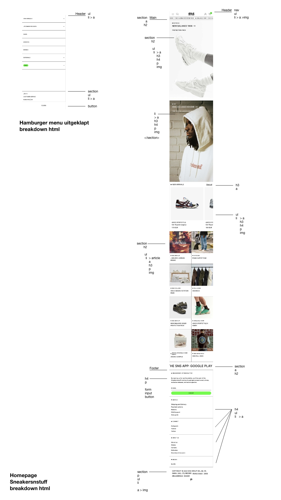
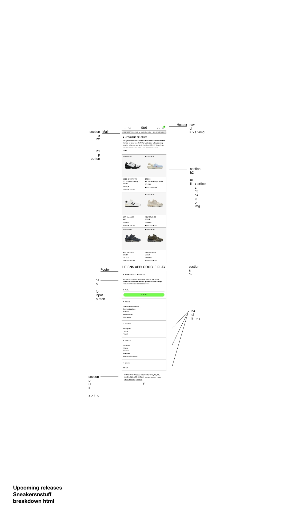
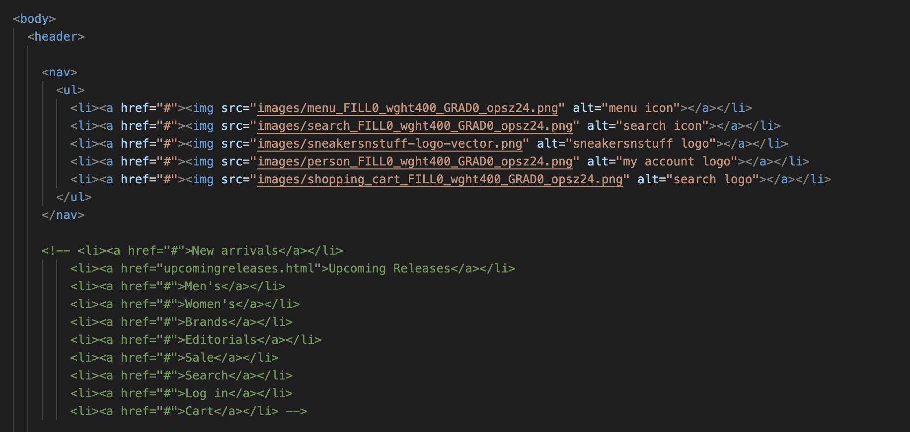
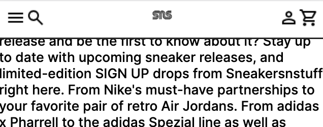
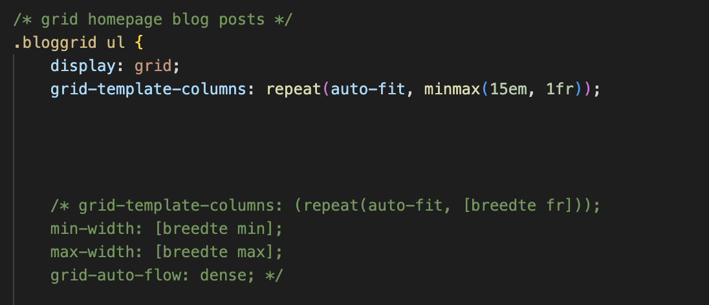
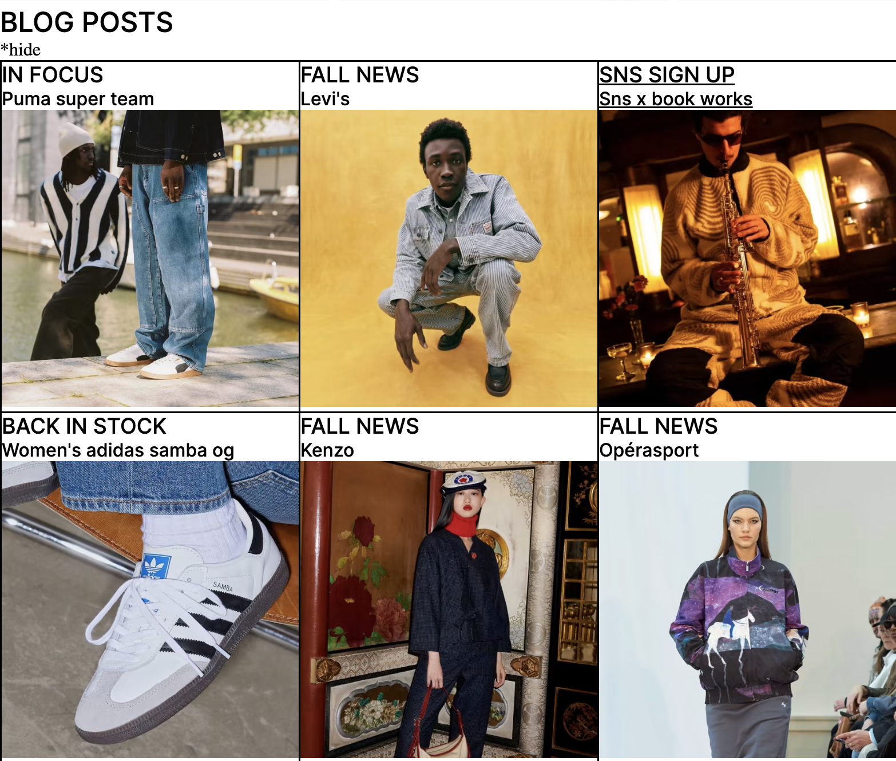
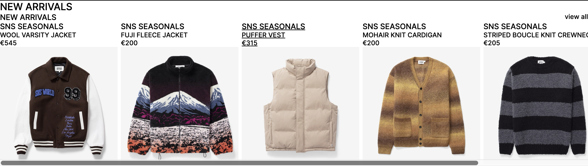
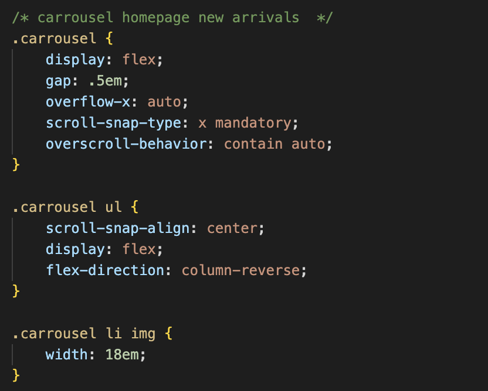

# Procesverslag
Markdown is een simpele manier om HTML te schrijven.  
Markdown cheat cheet: [Hulp bij het schrijven van Markdown](https://github.com/adam-p/markdown-here/wiki/Markdown-Cheatsheet).

Nb. De standaardstructuur en de spartaanse opmaak van de README.md zijn helemaal prima. Het gaat om de inhoud van je procesverslag. Besteedt de tijd voor pracht en praal aan je website.

Nb. Door *open* toe te voegen aan een *details* element kun je deze standaard open zetten. Fijn om dat steeds voor de relevante stuk(ken) te doen.

## Jij

  
uitwerken voor kick-off werkgroep

  ### Auteur:
  Elisa Zhao

  #### Je startniveau:
  Rood

  #### Je focus:
  Responsive
 

## Je website

  
uitwerken voor kick-off werkgroep

  ### Je opdracht:
  https://www.sneakersnstuff.com

  #### Screenshot(s) van de eerste pagina (small screen): 
  Home pagina  
  

  #### Screenshot(s) van de tweede pagina (small screen):
  Upcoming releases pagina 
  
 

## Toegankelijkheidstest 1/2 (week 1)

  
uitwerken na test in 2e werkgroep

  ### Bevindingen
  Lijst met je bevindingen die in de test naar voren kwamen:

  Content
  De taal die ze op de website gebruiken is niet complex.
  De buttons geven meestal aan wat het doet, als dat niet zo is kan je wel zien dat het een button is en dat je erop kan klikken.
  De links hebben ook een beschrijving wat het product is en waarop je komt wanneer je het aanklikt.
  
  Code
  Tijdens het valideren van de code kreeg ik 42 errors, 23 warnings en 48 info messaged, ook wanneer ik wat dieper in de code kijk
  zie ik wel dingen waaraan die niet voldoet zoals, de heading elements die niet overal zijn gebruikt of ze gebruiken het veel voor een class, je kan de website wel bedienen met je keyboard alleen zie je niet waar je op dat moment bent dit maakt het dus minder toegankelijk. In de code zelf wordt er vooral veel gebruik gemaakt van vele classes, divs en javascript zelfs voor de kleinste dingen.

  Mobiele ervaring
  De mobiele ervaring van de website is wel goed, je hebt de mogelijkheid om de website te draaien, de horizontale scroll gaat weg, de buttons and links zijn qua grote goed en het scroll gebied is goed. 

  Video & Audio
  Ze maken vrij weinig gebruik van video/audio wanneer dat wel wordt gedaan speelt het niet automatisch af en heb je de mogelijkheid om het te stoppen, maar is er geen mogelijkheid voor ondertiteling. 

  Controls
  Ze maken gebruik van een a element voor linkjes.
  De links zijn niet zo snel te herkennen als links. 
  Alleen pas wanneer je er overheen hovert met je muis, dan worden ze onderlijnt maar ook dit is niet altijd het geval.
  Daarnaast maken ze geen gebruik van een focus state als je het probeert te bedienen met je keyboard. 
  De buttons die worden weergeven zijn gemaakt met een button element, wel merk ik dat sommige links gestyled zijn als een button.

  Animatie 
  Ze maken wel gebruik van een animatie, dit is niet storend en speelt het niet te snel af je hebt hierbij niet de mogelijkheid om het stop te zetten.

  Uiterlijk
  Ze ondersteunen geen dark&light mode, de kleuren zijn vooral zwart/wit alleen de afbeeldingen niet maar in de beschrijving weergeven ze altijd de kleur van het item. Daardoor is de website niet perse afhankelijk van de kleur.
  Het contrast kan je altijd aanpassen, de tekst kan je ook vergroten en schaalt de website meteen mee. 
  De tekst is op sommige delen van de website wel aan de kleine kant, dit is niet voor iedereen goed leesbaar.

  Contrast
  Het kleuren contrast is goed, de tekst is soms wel aan de kleine kant en kan niet voor iedereen goed leesbaar zijn, de afbeeldingen blijft wel overal goed te zien alleen gebruiken ze in hun campagne tekst over een afbeelding dit is niet altijd goed leesbaar. 

## Breakdownschets (week 1)

  
uitwerken na afloop 3e werkgroep

  ### de hele pagina + dynamisch deel: 
  

  ### Upcoming releases pagina: 
  

## Voortgang 1 (week 2)

  
uitwerken voor 1e voortgang

  ### Stand van zaken 
  hier dit ging goed & dit was lastig (neem ook screenshots op van delen van je website en code)

  Deze week heb ik mij vooral bezig gehouden met het opzetten van een basis in de html, dit verliep vrijwel goed
  alleen twijfelde ik bij sommige onderdelen welke heading ik moest gebruiken en of ik voor iets wel een ul kon gebruiken.

  Bij het menu vind ik het nog lastig wat ik in de html moet zetten, want wanneer de website op mobiel scherm staat is de nav anders 
  dan dat die op desktop scherm staat. Ik heb allereerst beide uitgewerkt, maar zal ik later nog vragen hoe ik dit precies moet doen.
  

  Ik heb ook gewerkt aan het menu met css alleen kwam ik er later achter dat die nog helemaal niet responsive is en dus niet meeschaalt. 
  Daar moet ik dus nogmaals naar kijken!
  

  Voor deze week ben ik niet echt tevreden met mijn voortgang, ik heb alleen nog maar aan html gewerkt voor maar 1 pagine en ook weinig aan de css. Dit moet ik voor de volgende voortgang zeker inhalen! Dan wil ik tenminste klaar zijn met beide html's en een groot deel van beide css's hebben. 

  ### Agenda voor meeting
  samen met je groepje opstellen

  Student 1 - Elisa
  Wat moet er met javascript gedaan worden?
  Hoe uitgebreid moet de alt tekst zijn?
  Gebruik van sections, articles
  Hoe werkt de nav als die zich aanpast wanneer je het scherm responsive maakt?

  Student 2 - Zoë
  Hoe krijg ik de tekst ook responsive?
  Kan ik 2 ul lists in een menu plaatsen?

  Student 3 - Lynn
  Hoe krijg ik alleen de h1 responsive?
  Wanneer het scherm van mobiel naar laptop gaat, komt er een onderdeel bij in het menu. Hoe hebben ze dit gedaan?

  ### Verslag van meeting 
  hier na afloop snel de uitkomsten van de meeting vastleggen

  - Let op de structuur van je pagina.
    In de website wordt er veel gebruik gemaakt van een section > heading > ul > li > soms nog een article met daarin een heading en p 
  
  - Voeg nog enkele dingen toe in de meta van de html

  - Plaats een h2 heading bij een section, dit kan je later hiden maar dan wordt die wel voorgelezen door de voice over.
    Zo weet de gebruiker waar de section over gaat.
  
  - Kijk goed Wanneer het binnen de header valt, meestal zijn dit onderdelen die niet veranderen wanneer je naar een andere pagina gaat. 

## Voortgang 2 (week 3)

 
  
uitwerken voor 2e voortgang

  ### Stand van zaken 
  hier dit ging goed & dit was lastig (neem ook screenshots op van delen van je website en code)

  Ik heb deze week vooral verder gewerkt aan de css van mijn website
  Wat goed ging was het werken met grid, dit was aan het begin veel uitproberen maar uiteindelijk is het toch gelukt. 
  Het lastige was nog wel de blog posts onderaan de pagina responive krijgen en in combinatie met grid, dit is uiteindelijk wel 
  gelukt met hulp van de studentasisstenten.
  
  
  

  Flexbox ging ook goed, dit heb ik toegepast op deels de footer en de carrousel, dit is ook de eerste keer dat ik een carrousel 
  heb gemaakt en dit ging vrij snel en simpel!
  
  
  
  Daarnaast heb ik ook verder gewerkt aan styling van de verschillende elementen zoals 
  emoji's toevoegen (dit heb ik nieuw geleerd), teksten etc.
  maar moet ik nog wel wat dingen doen zoals animaties, borders, witruimtes om het geheel af te maken. 
  Ik heb ook geprobeerd om de afbeeldingen eerst te krijgen inplaats van de tekst, dit heb ik gedaan met flexbox > order:1; bijv.
  maar lukt dit telkens niet. 

  Ook heb ik geprobeerd om de tekst te verschuiven en juist te krijgen, maar lukte het niet om die responsive te krijgen.
    

  Ik ben deze week tevreden met de vooruitgang van mijn website en lijkt die al veel meer op het origineel, wel moet ik nog veel werken aan de styling van sommige elementen en mij meer focussen op 1 deel van de website en daarna pas verder gaan naar de volgende.

  ### Agenda voor meeting
  samen met je groepje opstellen

  Student 1 - Elisa
  Ik heb nu div’s gezet om de verschillende “kopjes” in de footer, mag dat? Of moet ik er sections van maken? <!-- ! -->
  Moet ik in de footer na de section ook een H2 zetten met een titel?
  Moet ik werken met meerdere css bestanden?
  Hoe krijg ik aan de linkerkant van de scherm geen border? Maar tussen de afbeeldingen wel?
  Hoe verander ik de style wanneer ik op het invulveld van een forum klik?
  Hoe krijg ik in de footer de laatste afbeelding eronder wanneer het scherm kleiner wordt? 
  Hoe zorg ik ervoor dat de tekst in de campaign header ook responsive wordt? 
  Hoe zorg ik ervoor dat ik allereerst het plaatje zie en dan pas de tekst? Doe ik dat met order? <!-- ! -->
  Van een volledig menu naar icoontjes en dat de style verandert, hoe werkt dat? <!-- ! -->

  Student 2 - Zoë
  Is het handig om flexbox te gebruiken of is left and bottom beter?
  Mag padding gebruikt worden?
  Wanneer ik hover zoom heb op een image, hoe zorg ik dat die tekst hetzelfde blijft?
  @fontface werkt niet?
  Hoeveel javascript moet je hebben?
  Is vijf witregels in css een must of mag je het zelf weten?
  Wanneer ik position relative en absolute gebruik op tekst komt de tekst in elkaar, wat is een goede manier om dit te fixen?

  Student 3 - Lynn
  Hoe doe je een searchbalk pop up?
  Waarom werkt flexbox niet meer wanneer ik position relative gebruik?
  Mag top/bottom etc. wel?
  Hoe werkt het met de font?
  Hoe krijg je een responsive slideshow van images?
  Mag je bij tekst die over images staan left en right etc. gebruiken?
  Hoe krijg ik de titels korter (om vormgeving redenen) wanneer het scherm kleiner wordt?

  ### Verslag van meeting
  hier na afloop snel de uitkomsten van de meeting vastleggen

  - Kijk ook vooral naar de originele website, als je bijv grid gebruikt kan je precies zien wat ze hebben gedaan en wat de textuur is.
  - sommige divs die je nu in je html hebt kan je aanpassen naar sections, dit is beter en kan je ook sections in sections zetten.
  - Om een afbeelding boven de tekst te zetten, zet je eerst op de parent de display:flex en dan op de children order.
  - In combinatie met media queries kan je de border op de afbeeldingen specifieker bepalen wanneer die schaalt.
  - Doormiddel van twee ul's te gebruiken in je nav kan je de twee verschillende menu's maken wanner de website van klein scherm naar groot scherm gaat of andersom. Als je scherm groter wordt dan zoveel pix etc. dan wordt de ene navigatie ingeschakeld en de andere uitgeschakeld, andersom dus ook. 

## Toegankelijkheidstest 2/2 (week 4)

  
uitwerken na test in 9e werkgroep

  ### Bevindingen
  Lijst met je bevindingen die in de test naar voren kwamen (geef ook aan wat er verbeterd is):

  Screenreader
  Screen reader werkt alleen staat er steeds bezocht link, uiteindelijk hebben we het nogmaals getest als incognito "prive op een browser zit" en dan worden de links niet als bezocht weergeven omdat ik de website al meerdere keren heb bezocht.
  Voor de rest gaat de screenreader door alles heen en kan je precies zien waar die op dat moment is doormiddel van :focus.

  Verbeteringen
  - Uit de test blijkt ook dat er vele dingen zijn verbetert, allereerst het valideren van de html pagina daar kreeg ik nu 0 errors.
  - Ook heb ik geprobeert om in de html zelf niet al te veel classes/divs/javascript te gebruiken voor elk klein onderdeel wat ze dus eerst wel hadden. 
  - De headings die ik nu gebruik zijn nu ook echt gebruikt als headings met titels, om iets te introduceren en niet alleen voor classes. 
  - Ook worden er nu geen heading levels overgeslagen. 
  - Wanneer je nu met je keyboard door de website gaat kan je precies zien waar je bent, ik heb vooral ervoor gezorgd om de verschillende states zoals focus, hover van elementen aan te passen zodat het meer duidelijkheid geeft. Dit vergroot ook de toengangkelijkheid. 
  - De tekst heb ik nu vergroot, omdat het allereerst niet goed leesbaar was. 
  - Ook heb ik achter de tekst die in een afbeelding stond een background geplaatst zodat dit goed leesbaar blijft 
  en niet in de afbeelding wegvalt.

## Voortgang 3 (week 4)

  
uitwerken voor 3e voortgang

  ### Stand van zaken
  hier dit ging goed & dit was lastig (neem ook screenshots op van delen van je website en code)
  Goed
  - Algemene styling
  - Responsiveness wanneer het scherm kleiner wordt dat sommige dingen wegvallen of juist andersom
  - Animatie 
  - States van de elementen

  Lastig
  - Menu 
  - positioneren van verschillende elementen (vooral in de nav)
  - bepaalde style elementen - fade in tekst 
  - in uitklap met button

  ### Agenda voor meeting
  samen met je groepje opstellen

  Student 1 - Elisa
- Hoe krijg ik mijn menu hetzelfde als het origineel qua positie?
- Hoe wordt de footer grid hetzelfde uitgelijnd als de grid erboven en dat de 1e kolom 2 blokken overneemt?
- Hoe krijg ik de footerbottom goed onder elkaar bij de a en img?
- Hoe krijg ik de pijltjes gericht op bepaalde woorden doe ik dat met nth-child wordt het dan wel overzichtelijk?
- Hoe werkt dat/wat bedoelen ze met skip link als je de website met controls gebruikt?
- Er zit geen video/audio in mijn website hoe doe ik het toegankelijkheid stukje van media, valt dat dan weg?
- Moest ik in de nav wel nou 1 kopje uitwerken of was dit al goed?
- In upcomingreleases komt animatie eerst maar het is geen h1

  Student 2 - Zoë
- hoe maak ik h5 responsive?
- hoe krijg ik mn nav als enige wat in beeld blijft en dat het dan scrolbaar is?

  Student 3 - Lynn
- wat kan ik als beste gebruiken om een img in mn footer te hebben?
- voor die images moet de link om h3 en img heen en kan ik die dan gwn leeg laten?

  ### Verslag van meeting
  hier na afloop snel de uitkomsten van de meeting vastleggen

  - punt 1
  - punt 2
  - nog een punt
  - ...

## Eindgesprek (week 5)

  
uitwerken voor eindgesprek

  ### Je uitkomst - karakteristiek screenshots:
  

  ### Dit ging goed/Heb ik geleerd: 
  Korte omschrijving met plaatjes

  

  ### Dit was lastig/Is niet gelukt:
  Korte omschrijving met plaatjes

  

## Bronnenlijst <!-- dit moet nog -->

  
continu bijhouden terwijl je werkt

  Nb. Wees specifiek ('css-tricks' als bron is bijv. niet specifiek genoeg). 
  Nb. ChatGpT en andere AI horen er ook bij.
  Nb. Vermeld de bronnen ook in je code.

  1. Auto-fit in .bloggrid
  https://css-tricks.com/auto-sizing-columns-css-grid-auto-fill-vs-auto-fit/

  2. Flexbox properties
  https://css-tricks.com/snippets/css/a-guide-to-flexbox/

  3. Icons in menubar
  https://fonts.google.com/icons?icon.platform=web

  4. Carrousel - homepage new arrivals
  DLO - Werkgroep 4
  
  5. grid - homepage blog posts 
  DLO - Werkgroep 3 

  6. Nav mee laten scrollen over de pagina heen - Chatgpt
  Om de navigatie (nav) mee te laten scrollen met de pagina, kun je gebruik maken van CSS. Dit wordt vaak gedaan door de position: 
  
  fixed; eigenschap te gebruiken. Hier is een eenvoudige stap-voor-stap uitleg:
  position: fixed;: Hiermee wordt het element gefixeerd op de positie ten opzichte van het venster. In dit geval wordt het aan de bovenkant van het venster vastgezet.
  top: 0;: Zorgt ervoor dat de bovenkant van het element op de bovenkant van het venster blijft.
  width: 100%;: Zorgt ervoor dat de navigatie de volledige breedte van het venster beslaat.

  7. De tekst blijft wrappen, maar ik wil dat alles op 1 lijn blijft hoe doe ik dat? - Chatgpt
  Als je wilt voorkomen dat de tekst binnen de elementen gaat wrappen bij het schalen, kun je de eigenschap white-space gebruiken. Je kunt deze instellen op nowrap, wat ervoor zorgt dat de tekst op één regel blijft staan, zelfs als dit betekent dat de tekst buiten de zichtbare grenzen van het element gaat.

