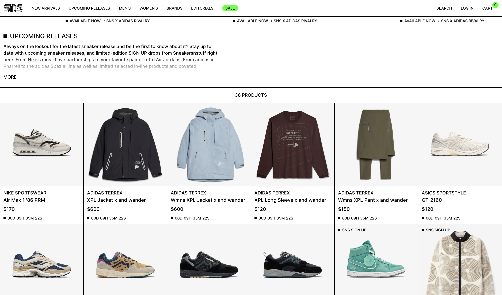

# Procesverslag
Markdown is een simpele manier om HTML te schrijven.  
Markdown cheat cheet: [Hulp bij het schrijven van Markdown](https://github.com/adam-p/markdown-here/wiki/Markdown-Cheatsheet).

Nb. De standaardstructuur en de spartaanse opmaak van de README.md zijn helemaal prima. Het gaat om de inhoud van je procesverslag. Besteedt de tijd voor pracht en praal aan je website.

Nb. Door *open* toe te voegen aan een *details* element kun je deze standaard open zetten. Fijn om dat steeds voor de relevante stuk(ken) te doen.

## Jij

  
uitwerken voor kick-off werkgroep

  ### Auteur:
  Elisa Zhao

  #### Je startniveau:
  Rood

  #### Je focus:
  Surface plane
 

## Je website

  
uitwerken voor kick-off werkgroep

  ### Je opdracht:
  https://www.sneakersnstuff.com

  #### Screenshot(s) van de eerste pagina (small screen): 
  Home pagina  
  

  #### Screenshot(s) van de tweede pagina (small screen):
  Upcoming releases pagina 
  
 

## Toegankelijkheidstest 1/2 (week 1)

  
uitwerken na test in 2e werkgroep

  ### Bevindingen
  Lijst met je bevindingen die in de test naar voren kwamen:

  Code
  De globale code is allereerst wel goed, wanneer ik wat dieper in de code kijk
  zie ik wel enkele dingen waaraan die niet voldoet zoals, de heading elements die niet overal zijn gebruikt, de meeste images hebben geen alt tekst, ook kan je de website niet bedienen met je keyboard waardoor het minder toegankelijk is. 
  In de code zelf wordt er vooral veel gebruik gemaakt van vele classes, divs en javascript zelfs voor de kleinste dingen.

  Mobiele ervaring
  De mobiele ervaring van de website is wel goed, je hebt de mogelijkheid om de website te draaien, de horizontale scroll gaat weg, de buttons and links zijn qua grote goed en het scroll gebied is goed. 

  Video & Audio
  Ze maken vrij weinig gebruik van video/audio wanneer dat wel wordt gedaan speelt het niet automatisch af en heb je de mogelijkheid om het te stoppen, maar is er geen mogelijkheid voor ondertiteling. 

  Controls
  Ze maken wel gebruik van een a element voor linkjes dit wordt vooral gedaan in de footer, de andere delen niet echt. 
  De links zijn niet zo snel te herkennen als links, alleen pas wanneer je er overheen hovert met je muis. 
  Daarnaast maken ze geen gebruik van een focus state als je het probeert te bedienen met je keyboard. 
  De buttons die worden weergeven zijn ook niet gemaakt met een button element. 

  Animatie 
  Ze maken wel gebruik van een animatie, dit is niet storend en speelt het niet te snel af je hebt hierbij niet de mogelijkheid om het stop te zetten.

  Uiterlijk
  Ze ondersteunen geen dark&light mode, de kleuren zijn vooral zwart/wit alleen de afbeeldingen niet maar in de beschrijving weergeven ze altijd de kleur van het item. Daardoor is de website niet perse afhankelijk van de kleur.
  Het contrast kan je altijd aanpassen, de tekst kan je ook vergroten en schaalt de website meteen mee. 

  Contrast
  Het kleuren contrast is goed, de tekst en afbeeldingen blijven overal goed leesbaar. 

## Breakdownschets (week 1)

  
uitwerken na afloop 3e werkgroep

  ### de hele pagina: 
  

  ### dynamisch deel (bijv menu): 
  

  ### wellicht nog een dynamisch deel (bijv filter): 
  

## Voortgang 1 (week 2)

  
uitwerken voor 1e voortgang

  ### Stand van zaken
  hier dit ging goed & dit was lastig (neem ook screenshots op van delen van je website en code)

  ### Agenda voor meeting
  samen met je groepje opstellen

  | student 1      | student 2          | student 3    | student 4        |
  | ---            | ---                | ---          | ---              |
  | Wat moet er    | tekst responsive 
                     krijgen
    met Javascript
    gedaan worden?

    Hoe uitgebreid moet
    de alt tekst zijn?

    Volgorde van heading
    elementen

    Gebruik van sections,
    articles 

    Animaties en hoe 
    doe ik dat eerst in 
    html

    Moet je ook de gehele 
    uitklap menu verwerken?
  
 |                    | en ik dit    | en dan ik dat    |
  |                |                    | nog een punt | dit wil ik zeker |
  | ...            | ...                | ...          | ...              |

  ### Verslag van meeting
  hier na afloop snel de uitkomsten van de meeting vastleggen

  - punt 1
  - punt 2
  - nog een punt
  - ...

## Voortgang 2 (week 3)

  
uitwerken voor 2e voortgang

  ### Stand van zaken
  hier dit ging goed & dit was lastig (neem ook screenshots op van delen van je website en code)

  ### Agenda voor meeting
  samen met je groepje opstellen

  | student 1      | student 2          | student 3    | student 4        |
  | ---            | ---                | ---          | ---              |
  | dit bespreken  | en dit             | en ik dit    | en dan ik dat    |
  | en dat ook nog | dit als er tijd is | nog een punt | dit wil ik zeker |
  | ...            | ...                | ...          | ...              |

  ### Verslag van meeting
  hier na afloop snel de uitkomsten van de meeting vastleggen

  - punt 1
  - punt 2
  - nog een punt
- ...

## Toegankelijkheidstest 2/2 (week 4)

  
uitwerken na test in 9e werkgroep

  ### Bevindingen
  Lijst met je bevindingen die in de test naar voren kwamen (geef ook aan wat er verbeterd is):

## Voortgang 3 (week 4)

  
uitwerken voor 3e voortgang

  ### Stand van zaken
  hier dit ging goed & dit was lastig (neem ook screenshots op van delen van je website en code)

  ### Agenda voor meeting
  samen met je groepje opstellen

  | student 1      | student 2          | student 3    | student 4        |
  | ---            | ---                | ---          | ---              |
  | dit bespreken  | en dit             | en ik dit    | en dan ik dat    |
  | en dat ook nog | dit als er tijd is | nog een punt | dit wil ik zeker |
  | ...            | ...                | ...          | ...              |

  ### Verslag van meeting
  hier na afloop snel de uitkomsten van de meeting vastleggen

  - punt 1
  - punt 2
  - nog een punt
  - ...

## Eindgesprek (week 5)

  
uitwerken voor eindgesprek

  ### Je uitkomst - karakteristiek screenshots:
  

  ### Dit ging goed/Heb ik geleerd: 
  Korte omschrijving met plaatjes

  

  ### Dit was lastig/Is niet gelukt:
  Korte omschrijving met plaatjes

  

## Bronnenlijst

  
continu bijhouden terwijl je werkt

  Nb. Wees specifiek ('css-tricks' als bron is bijv. niet specifiek genoeg). 
  Nb. ChatGpT en andere AI horen er ook bij.
  Nb. Vermeld de bronnen ook in je code.

  1. bron 1
  2. bron 2
  3. ...

